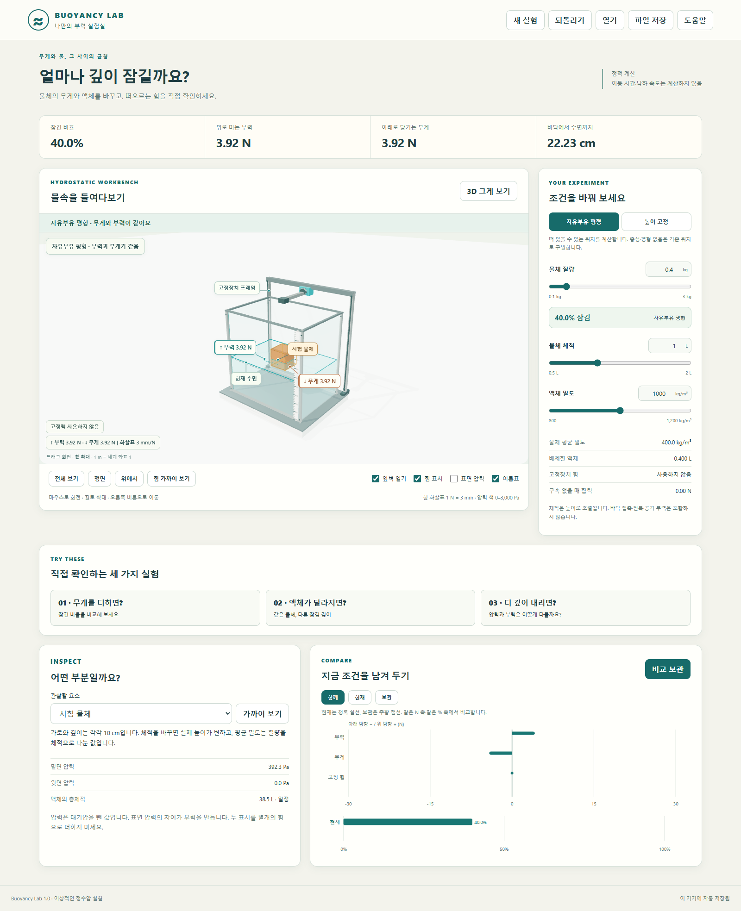

# Buoyancy Lab 1.0

투명한 수조 안의 물체를 보며 질량·체적·액체 밀도와 부력의 관계를 실험하는 교육용 데스크톱 앱입니다. 조건을 바꾸면 새로운 **정적 상태**를 계산합니다. 가라앉거나 떠오르는 이동 시간은 계산하지 않습니다.



[릴리스와 설치 파일](https://github.com/Ulsancl/buoyancy-lab/releases/latest) · [설치 안내](docs/distribution.md) · [문제 보고 안내](docs/support.md)

설치 파일과 해당 버전의 실제 검증 결과는 공개된 릴리스에서 확인하세요. 이 소스의 버전 표기만으로 릴리스 게시·검사 통과를 뜻하지 않습니다.

## 무엇을 볼 수 있나요?

- 자유부유 평형과 높이 고정 모드에서 잠긴 비율, 부력, 무게와 양방향 고정장치 힘을 비교합니다.
- 액체 38.5 L를 담은 유한 수조에서 물체가 배제한 체적만큼 수면이 올라갑니다. 체적 조절은 물체의 실제 높이에 반영됩니다.
- 앞벽 열기, 고정 이름표, 힘 표시와 표면 압력 표시, 부품 선택과 집중 관찰을 제공합니다.
- 힘 옆의 방향·N 수치와 `힘 가까이 보기`로 부력·무게·위나 아래로 작용하는 고정력을 읽습니다. 화살표의 실제 길이는 항상 3 mm/N이고, 카메라 확대만 바뀝니다. 0 N은 화살표를 만들지 않습니다.
- 질량·액체 밀도·완전잠김 깊이에 관한 세 안내 실험은 실제 조건을 맞춘 뒤 관찰을 확인하는 방식입니다.
- 현재 조건과 보관 조건을 같은 힘(N) 축과 잠김 비율(%) 축에서 비교합니다. 보관 조건은 현재 조건을 바꾸어도 유지됩니다.

처음에는 0.4 kg / 1 L / 1,000 kg/m³ 조건에서 물체가 40% 잠깁니다. 질량을 0.8 kg으로 바꾸면 잠김 비율은 80%가 됩니다. 높이 고정에서는 위로 당기는 힘과 아래로 누르는 힘을 구별합니다.

중성부력은 여러 완전잠김 높이에서 평형입니다. 화면은 대표 위치 하나를 보여 줍니다. 물체가 더 무거워 자유부유 평형이 없는 경우에도 힘을 읽을 수 있는 기준 위치를 표시하며, 도달한 평형이나 실제 침강 경로라고 표현하지 않습니다.

## 실행과 검사

Node.js 24.19와 npm을 기준으로 개발합니다. 의존성은 lockfile에 고정합니다.

```powershell
npm ci
npm run dev
npm test
npx --no-install playwright install chromium
npm run test:browser
npm run test:consumer
node scripts/desktop.mjs prepare-test
npm run test:desktop
npm run desktop
```

개발 화면은 `http://127.0.0.1:5270`입니다. 개발 서버는 사용 후 종료하고 다음 명령을 실행합니다. 브라우저 검사는 별도의 5271, 소비자 관찰 검사는 5273 포트를 사용합니다. `prepare-test`는 Electron 런타임과 데스크톱용 번들을 준비합니다. 각 화면 검사는 순차 실행합니다. 이 명령 목록은 검사 통과 기록을 뜻하지 않습니다.

## 설치 파일 만들기

```powershell
npm run package:desktop
```

Windows x64 NSIS 설치 파일과 체크섬은 다음 위치에 생성됩니다.

- `release/windows/Buoyancy-Lab-Setup-1.0.0.exe`
- `release/windows/Buoyancy-Lab-Setup-1.0.0.exe.sha256`

코드 서명과 자동 업데이트는 제공하지 않습니다. 다운로드한 설치 파일과 `.sha256`의 해시를 확인하고 직접 실행합니다. 실제 설치·호환성 범위는 해당 릴리스의 결과 기록을 따릅니다. 배포 및 앱 데이터 보존에 관해서는 [설치와 배포 범위](docs/distribution.md)를 참고하세요.

## 저장과 다시 열기

`.buoyancy.json`은 조건·보관 비교·시점·표시 선택을 보관합니다. 힘·압력·수면 등 파생값은 열 때 다시 계산하고 안내 진행은 저장하지 않습니다. 잘못되거나 더 새로운 형식의 파일은 원문을 수정하지 않고 거부합니다. 보호된 자동 저장 원문은 별도로 내려받을 수 있습니다. 자세한 형식과 데스크톱 원자 저장 동작은 [저장 안내](docs/storage.md), 로컬 자료의 범위는 [개인정보 안내](docs/privacy.md)에 설명합니다.

## 모형 범위와 권리

균질한 정지 유체, 방향이 고정된 직육면체 하나, 이상적인 무체적 고정 연결부를 사용합니다. 파동·점성·회전·전복·바닥 접촉·표면장력·공기 부력은 포함하지 않습니다. 실물 재료나 선박 안전을 검증하는 장치가 아닙니다. [모형 설명](docs/model.md), [구조 설명](docs/anatomy.md), [원리 참고 자료](docs/references.md)에서 가정과 표현을 확인할 수 있습니다.

자체 소스와 원본 자산은 `UNLICENSED`이며 [LICENSE.txt](LICENSE.txt)를 따릅니다. 소스 공개 자체가 재배포·상업적 이용 허락을 뜻하지 않습니다. 포함된 외부 구성 요소의 권리는 [제3자 고지](docs/THIRD-PARTY-NOTICES.md)와 각 원문 라이선스를 따릅니다. [릴리스 확인 기준](docs/release-checklist.md)은 실제 결과와 검증 범위를 구별해 기록합니다.
